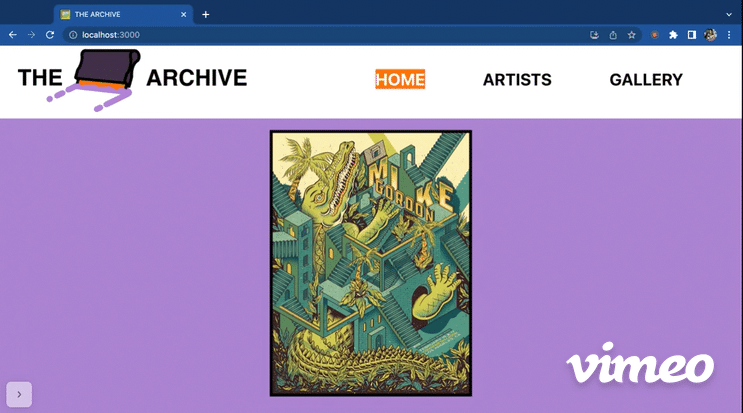

# THE ARCHIVE

Welcome to the backend of THE ARCHIVE!

This Ruby repository was designed in tandem with a [React single-page application](https://github.com/ajdavid128/phase-3-group-project-front-end-react) by [Leah Cardoz](https://github.com/lcardoz) and [Aaron David](https://github.com/ajdavid128) for their Phase 3 software engineering group project at Flatiron School (1 week to build).

## Project Details & Motivation:

The focus of THE ARCHIVE project was to build a fullstack application from the ground up. Leah and Aaron chose to build a back-end around their mutual interest of screen print artists and their respective prints. They utilized building a Sinatra API backend that uses Active Record to access and persist data in a database, create multiple end-points which is used by a separate React frontend that interacts with the database via the API.

> All artwork and artist info are property of their rightful respective owner. 
Usage of artist and print images are for educational, non-commercial purposes only.

## Learning Goals:

- Create models to migrate into a database
- Build out a database with tables and columns based on our models
- Utilize Active Record and Associations to build out methods to incorporate into controllers for RESTful Routing
- Build a completed API with full CRUD routing capabilities 
- Have a front-end React app communicate with the API to preform CRUD actions

## Demos:

[Watch Leah demo the entire app here!](https://vimeo.com/799986630)

**Home Page:**

**Artists Page / Artist Detail:**

**Add New Artist Feature:**

**Add New Print Feature:**

**Prints Gallery:**

